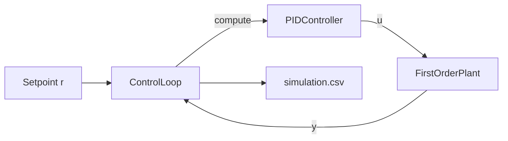
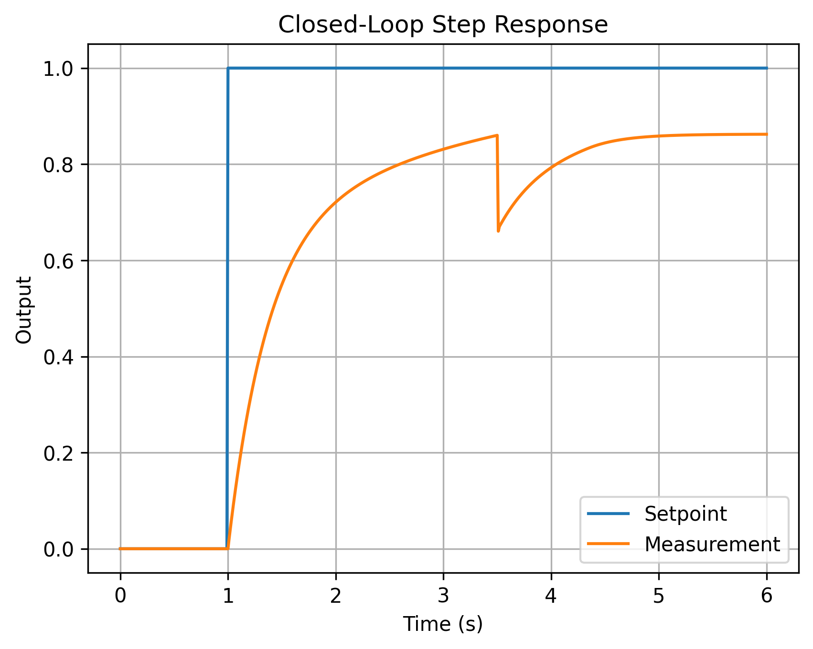
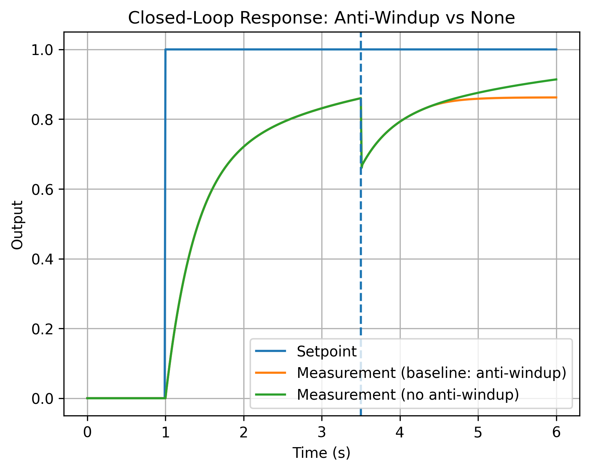

# C++ PID Control System Simulation

This project demonstrates an object-oriented implementation of a discrete-time PID controller in C++, applied to a closed-loop simulation of a dynamic system.

The goal is to model and simulate control behavior in a structured and modular software architecture, similar to control-oriented software used in mechatronic systems.

---

## Architecture

The system is divided into three main components:

### 1. PIDController

- Discrete-time PID implementation (P, I, D terms)
- Configurable sampling time (dt)
- Optional output saturation (actuator limits)
- Integral clamping to prevent windup
- Encapsulated internal state

### 2. FirstOrderPlant

- Simulated dynamic system:

  dy/dt = -a*y + b*u

- Discretized using forward Euler
- Represents a simplified physical process (e.g., motor speed or temperature)

### 3. ControlLoop

- Executes closed-loop simulation
- Applies step setpoint change
- Injects disturbance
- Logs results to CSV for validation and analysis

---

## MBSE-style View (System Decomposition)

The simulation is structured as three collaborating blocks, similar to a SysML-style decomposition:



### Interfaces

- PIDController: input → (r, y), output → u

- FirstOrderPlant: input → u, output → y

- ControlLoop: orchestrates sampling, state updates, and logging

> This separation enforces clear responsibility boundaries and allows each component to be tested and extended independently.

---

## Example Closed-Loop Response



---

## Comparison: Anti-Windup vs None



The figure above compares closed-loop behavior with and without integral anti-windup under actuator saturation.

### Experiment Setup

- Actuator saturation limits: [-2.0, 2.0]
- Step setpoint applied at t = 1s
- Disturbance injected at t = 3.5s
- Identical PID gains in both cases

### Observations

- Both controllers track the step input and respond to the disturbance.
- Without anti-windup, the integral term continues accumulating error while the actuator is saturated.
- With anti-windup enabled, integral growth is constrained, leading to more controlled and predictable recovery behavior.
- Anti-windup improves robustness when actuator limits are active.

### Engineering Insight

- In embedded control systems, actuators are physically limited.
- When saturation occurs, the integral term may accumulate excessively (integrator windup), causing degraded transient performance or instability.
- Explicit integral clamping mitigates this effect and is a common design consideration in real-world mechatronic systems.

---

## Features

- Object-oriented design with clear separation of concerns
- Discrete-time control implementation
- Anti-windup strategy
- Actuator saturation handling
- Configurable simulation parameters
- CSV-based logging for response analysis

---

## Build Instructions

```bash
cmake -S . -B build
cmake --build build -j
./build/cpp_pid_control_simulation
```

**This generates:**

```
simulation.csv
```

With columns:

```
time, setpoint, measurement, control
```

---

## Design Decisions

### 1. Discrete-Time Implementation

The controller is implemented in discrete time using a fixed sampling interval (dt).  
This mirrors real embedded control systems where software executes periodically in a time-triggered loop.

### 2. Integral Anti-Windup

Integral clamping is used to prevent windup when actuator saturation occurs.  
This reflects practical control constraints in real-world systems.

### 3. Output Saturation

Actuator limits are modeled explicitly to simulate physical system constraints.

### 4. Separation of Concerns

Controller, plant, and orchestration logic are separated into independent modules.  
This improves the system's maintainability, testability, and extensibility.

---

## Why This Project

This project demonstrates:

- C++ object-oriented design

- Control systems fundamentals (PID, feedback loops)

- Discrete-time simulation

- Modular system architecture

- Engineering-oriented software structure

> It reflects control-oriented development in multidisciplinary mechatronic environments.
